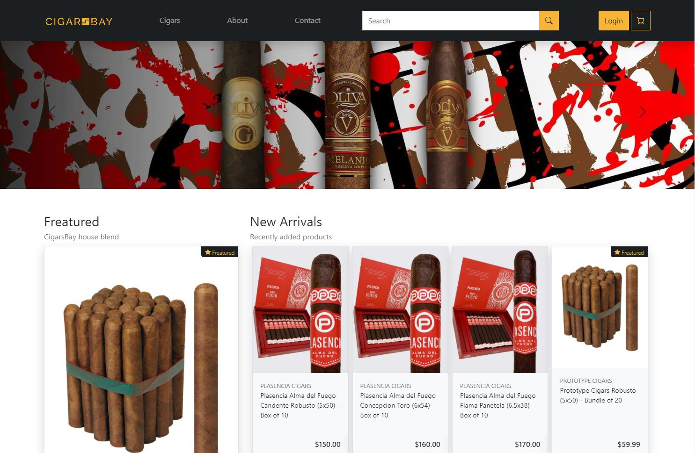
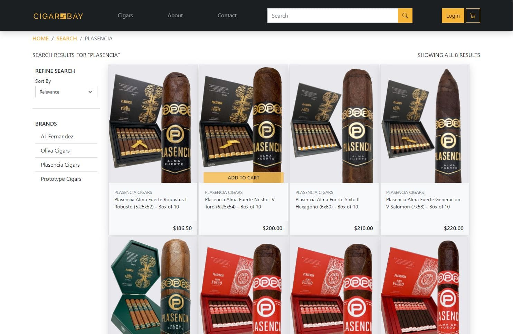
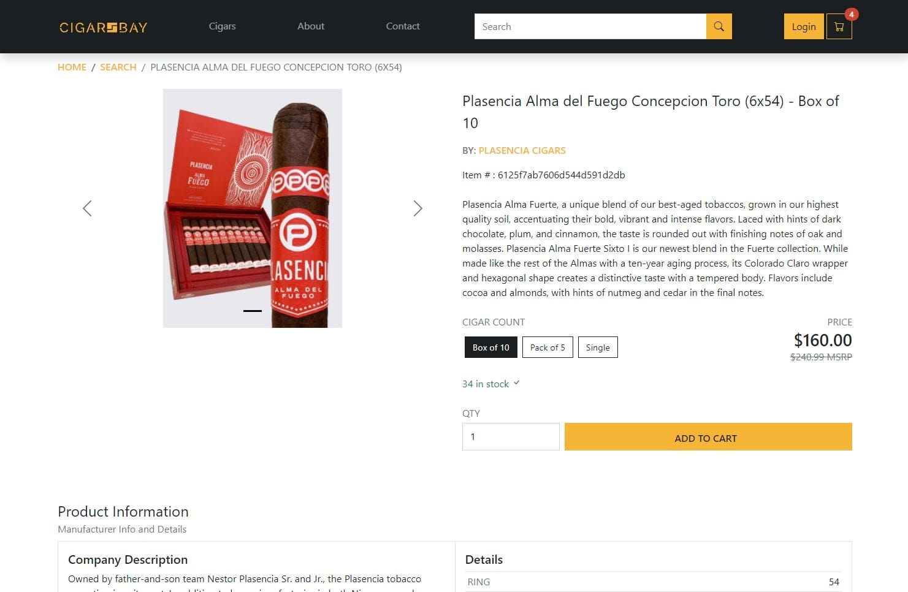

# CigarsBay Online E-Commerce Shop 
> E-Commerce platform build with MERN Stack and Redux <br>
> Live Demo -> [CigarsBay](https://cigars-bay-app.herokuapp.com/ "Live Demo")

This is an online e-commerce cigar shop being built using the MERN Stack (MongoDB, Express, React & NodeJS). I developed the login & sign-up functionality from scratch, using jwson web tokens & bcrypt to achieve login persistance. Mongoose was used with MongoDB to handle models and schemas.

On the front end I used bootstrap 5 for quick and simple layout with slight style modifications. Redux was also implemented to handle the application states when loading data and interacting with the UI elements.

Currently hosted on heroku since it is a work process, expected to be functional by the end of the year. This shop will use paypal for payment processing, and admin page to handle users, orders and products.


**Shop Home Page** - *Fixed top navbar with searchbox, carousel to showcase promos, also freatured products*

- - - 


**Search page** - *Sorting Functionallity with Pagination, add to cart is possible from the product card*

- - - 


**Product Page** - *Displays product information, ability to select different skus *

- - -

## Details
- Register and Login persistance functionality in NodeJS with jsonwebtokens and bcrypt
- MongoDB used with Mongoose to handle models and schemas 
- Redux used in the frontend to handle application state 
- Bootstrap 5 raw files used with React (Not Bootstrap Components) 
- Styled Components used to handle small style changes and custom animations

## Freatures

- [x] User Account
- [x] Shopping Cart
- [x] Product Search with Pagination & Sorting
- [x] Checkout Process 
- [] Credit Card Integration
- [] Admin Product Managment   
- [] Admin User Managment   
- [] Admin Order Managment   
- [] Admin Vendor Managment     
- [] Product reviews and ratings

# Usage
## Env Variable
Create a .env file in the root with these variables
```bash
NODE_ENV = development
PORT = 5000
MONGO_URI = your mongodb uri
JWT_SECRET = 'jwtsecrethere'
```

## Install Dependencies for Client & Server
```bash
npm i 
cd client
npm i
```

